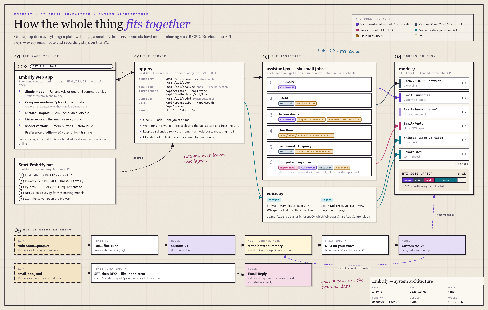

# Embrify — AI Email Summarizer

A local AI email assistant. Paste an email and get its **summary, intent, action items, deadlines,
sentiment / urgency and a suggested reply** — all generated on your own PC by small open models.
No cloud, no API keys: emails, votes and recordings never leave the machine.



## Features

- **Full analysis** in six sections that stream in one by one:
  Summary · Intent · Action Items · Deadline · Sentiment / Urgency · Suggested Response
- **Four summary styles**: short summary, bullet points, action items, one line (TL;DR)
- **Compare mode**: two summaries side by side (original vs fine-tuned model) — tap ♥ on the better one,
  and your votes train the next model version (DPO)
- **Model versions**: every trained version is kept (Custom-v1, v2, …) and selectable in the header
- **Voice**: dictate an email or import an audio file (Whisper), have the email or reply read aloud (Kokoro)
- **Import** `.eml` / `.txt` emails; works offline once the models are downloaded
- Responsive web UI for desktop, tablet and phone

## Quick start (Windows)

Double-click **`Start Embrify.bat`**. On the first run it:

1. finds Python 3.10–3.12, or installs Python 3.12 with winget
2. creates a private environment in `%LOCALAPPDATA%\Embrify`
3. installs PyTorch (CUDA if an NVIDIA GPU is found, otherwise CPU) and `requirements.txt`
4. downloads the public models it needs (`setup_models.py`, ~3 GB)
5. starts the app and opens <http://127.0.0.1:7860>

Later runs start in seconds. Close the console window to stop the app.

### Manual setup (any OS)

```bash
pip install torch==2.6.0 --index-url https://download.pytorch.org/whl/cu124   # or .../whl/cpu
pip install -r requirements.txt
python setup_models.py
python app.py                     # web app at http://127.0.0.1:7860
python app.py --analyze email.txt # analysis in the terminal
```

## How it works

| Section | Done by |
|---|---|
| Summary | fine-tuned summarizer (Custom-vN) |
| Intent | original Qwen2.5-0.5B-Instruct + subject line |
| Action items | fine-tuned summarizer + the email's own request sentences and numbered deliverables |
| Deadline | rules: "by / due / scheduled for" followed by a date |
| Sentiment / Urgency | original model · rules (urgent words, how soon the deadline is) |
| Suggested response | reply model (SFT + DPO) → fine-tuned → original → template; every draft is checked |

Each section has its own small prompt, and every model answer is checked by rules and replaced if it fails,
which keeps a 0.5B model grounded in the email.

## Project layout

| Path | What it is |
|---|---|
| `app.py` | FastAPI server: models, streaming API, preference training, version switching |
| `assistant.py` | the six-section email analysis |
| `voice.py`, `spacy_lite.py` | speech-to-text and text-to-speech |
| `frontend/index.html` | the web app (plain HTML/CSS/JS) |
| `train.py` | LoRA fine-tune of the summarizer on `train-00000-of-00001.parquet` |
| `train_dpo.py` | DPO on your Compare-mode votes → next Custom-vN |
| `train_reply_dpo.py` | SFT + DPO reply model on `email_dpo.jsonl` |
| `setup_models.py` | downloads missing public models |
| `Start Embrify.bat` | one-click install and start on Windows |
| `docs/` | architecture diagram |

## Models

Downloaded automatically into `models/` (not stored in this repository):

- [Qwen/Qwen2.5-0.5B-Instruct](https://huggingface.co/Qwen/Qwen2.5-0.5B-Instruct)
- [openai/whisper-large-v3-turbo](https://huggingface.co/openai/whisper-large-v3-turbo)
- [hexgrad/Kokoro-82M](https://huggingface.co/hexgrad/Kokoro-82M)

The trained models (summarizer and reply model) are created by the training scripts. Without them the app
still works: the original model writes the summaries and replies fall back to the other models or a template.

```bash
python train.py            # fine-tuned summarizer → models/Qwen2.5-0.5B-Email-Summarizer
python train_reply_dpo.py  # reply model           → models/Qwen2.5-0.5B-Email-Reply
```

## Requirements

Python 3.10–3.12. An NVIDIA GPU with 6 GB is recommended (everything loaded uses about 5 GB); CPU works, slowly.
